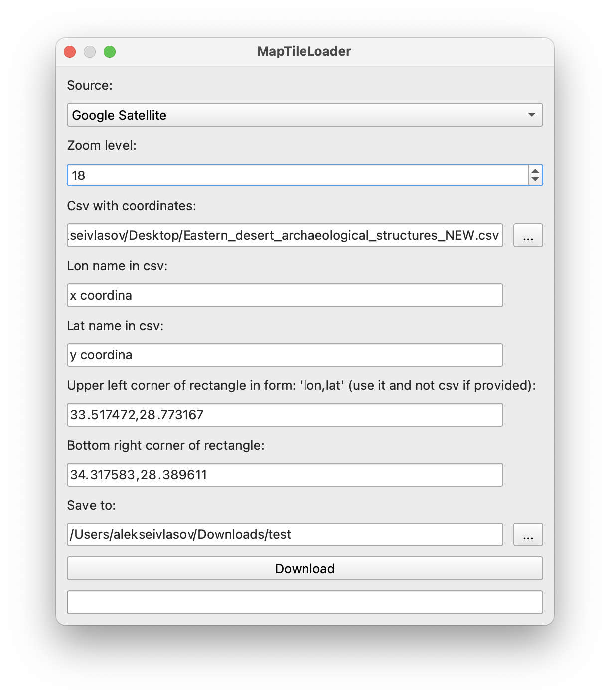

# Руководство по установке и использованию плагина для скачивания тайликов с google satellite карт

## 1. Установка QGIS

### 1.1 Скачивание QGIS
Для начала необходимо установить QGIS. Для этого выполните следующие шаги:

1. Перейдите на официальный сайт [QGIS](https://qgis.org/download/).
2. Перейдите на вкладку "Загрузки" и выберите версию, соответствующую вашей операционной системе (Windows, macOS или Linux).
3. Следуйте инструкциям по установке для вашей операционной системы.

## 2. Установка плагина

### 2.1 Скачивание плагина
1. Зайдите в QGIS.
2. В верхнем меню зайдите в `Manage and Install Plugins...`.
3. В поиске найдите плагин `MapTileLoader` и установите его.

### 2.2 Изменение содержимого плагина в QGIS
1. Откройте QGIS.
2. В верхнем меню `Settings` -> `User profiles` -> `Open Active Profile Folder`.
3. Откроется папка `default`.
4. Идем в папку `pуthon` -> `plugins` -> `map_tile_loader`.
5. В ней меняем файл `map_tile_loader_dialog.py` на [мой файл](./map_tile_loader_dialog.py).
6. Перезапускаем QGIS.

## 3. Использование плагина

1. Заходим в QGIS.
2. В верхнем меню выбираем `Plugins` -> `MapTileLoader`.
3. Откроется меню:

4. Для начала выбираем источник, откуда мы скачиваем (я все время использовал `Google Satellite`).
5. И `Zoom level`, я использовал 18.

### 3.1 Скачивание из csv файла

1. В поле `Csv with coordinates` пишем путь к нашему csv.
2. В следующих двух полях пишем как называются столбцы с lon и lat координатами соответственно.
3. Поля `Upper left corner...` и `Bottom right corner...` должны быть пустыми.
4. Указываем папку, куда мы будем скачивать тайлики (она должна существовать).
5. Нажимаем `Download`.

### 3.2 Скачивание прямоугольника целиком

1. В поле `Upper left corner` пишем координаты левого верхнего угла прямоугольника в порядку lon, lat через запятую.
2. Аналогично в поле `Bottom right corner...` пишем координаты правого нижнего угла.
3. Указываем папку, куда мы будем скачивать тайлики (она должна существовать).
4. Нажимаем `Download`.

## 4. Особенности

1. Все поля сохраняются между запусками.
2. Файлы скачиваются последовательно и нумеруются от `000000.jpg` до `999999.jpg`.
3. Если по какой-то причине скачивание остановилось, то просто можно перезапустить QGIS и плагин, и снова нажать 
`Download` (так как все поля сохраняются). Загрузка продолжится с тех файлов, которые еще не скачаны.

## 5. Поддержка и обратная связь

Если у вас возникли проблемы с плагином или есть вопросы, напишите в тг @AlxVlsv.
